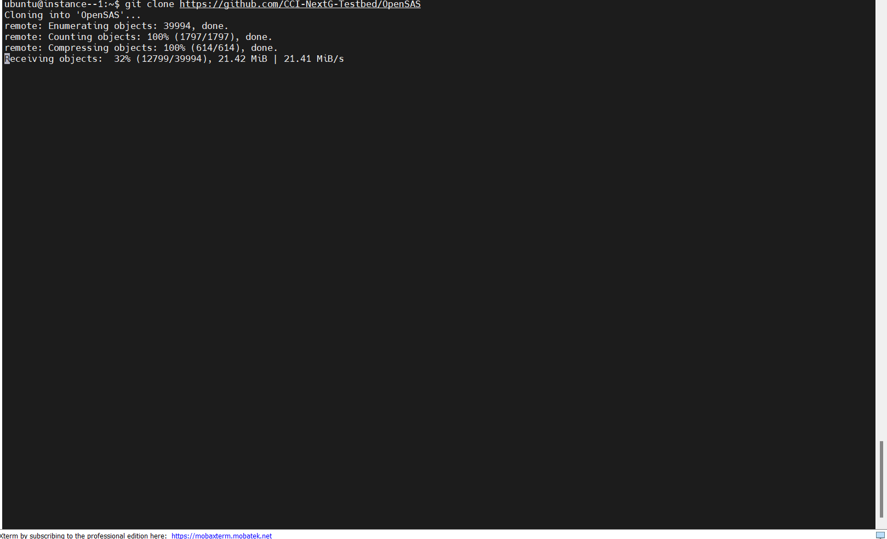
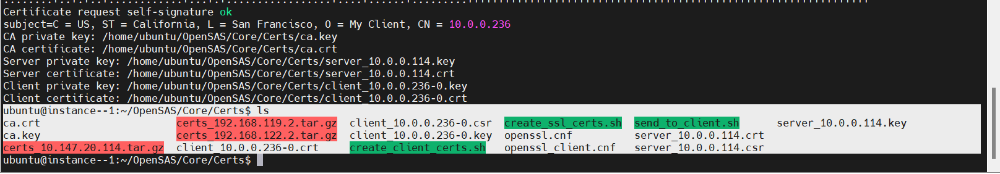
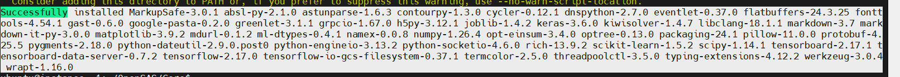

.. Experiments
.. ===========

.. The experiment is about demonstration of OpenSAS Server and CBSD Integration for GAA and PAL Operations using srsRAN and Open5GS. The setup will use one VM/PC running OpenSAS and dashboard and another VM/PC running CBSD client with srs gNB in ZMQ mode.

.. Setting Up the Testbed
.. ----------------------

.. The testbed consists of:

.. - :ref:`OpenSAS Core <start-opensas-server>`
.. - :ref:`OpenSAS Dashboard <launch-opensas-dashboard>`
.. - :ref:`CBSD with srs gNB <running-cbsd-client>`

.. .. _start-opensas-server:

.. 1. Start the OpenSAS Server
.. ---------------------------

..    From the VM hosting OpenSAS, start the OpenSAS Server:

..    .. code-block:: bash

..       python server.py

..    First, ensure that the OpenSAS server is running.

.. .. _launch-opensas-dashboard:

.. 2. Launching the OpenSAS Dashboard
.. ----------------------------------

..    Once started, launch the OpenSAS dashboard:

..    .. code-block:: bash

..       npm run dev

..    Verify that it is both operational and accessible at `http://localhost:9528/`.

.. .. _running-cbsd-client:

.. 3. Running the CBSD Client
.. --------------------------

..    In the VM hosting the CBSD client (with Open5GS core, srsRAN gNB, and RF frontend connected), run GAA CBSD first:

..    a. **Open a New TMUX Session**

..    This allows you to manage multiple terminal sessions.

..    b. **Run the following command to start the GAA CBSD first**

..    .. code-block:: bash

..       python3 run.py --lat 38.88086127246137 --lon -77.11558699967016 --fcc GAA-Arlington --low 3610e6 --high 3620e6 -eirp 20 -react 0

..    - After running this, you should see a registration request from the CBSD client sent to OpenSAS, a spectrum inquiry, and then OpenSAS grants. The corresponding prints will show up in the OpenSAS dashboard and OpenSAS console. After a successful grant, another terminal will open up, starting the srsRAN 5G gNB.
..    - You will now be able to view this CBSD information in the CBSD list, Spectrum list, and map in the OpenSAS dashboard.

..    - The experiments can be found in :ref:`Output for GAA Operation <gaa-operation>`

.. 4. Running the CBSD Client
.. --------------------------

..    Similarly, terminate the `run.py` program in the CBSD console and execute the PAL user CBSD client using:

..    .. code-block:: bash

..       python3 run.py --lat 38.8818743855486 --lon -77.11132435717902 --fcc CCI-CBRS-PAL --low 3610e6 --high 3620e6 -eirp 20 -react 0

..    - The experiments can be found in :ref:`Output for PAL Operation <pal-operation>`

.. .. _gaa-operation:

.. 5. Output for GAA Operation
.. ---------------------------

.. - **This image shows the OpenSAS log indicating the CBSD registration.**

..   .. figure:: _static/image15.png
..      :align: center
..      :alt: OpenSAS Log
..      :width: 150%
..      :scale: 50%

..      **Figure 5:** OpenSAS log indicating the CBSD registration.
.. .. raw:: html

..     

.. - **This image shows the CBSD console logs indicating the CBSD registration and messages for Spectrum Inquiry Request, Grant Request, and other info.**

..   .. figure:: _static/image16.png
..      :align: center
..      :alt: CBSD Console Logs
..      :width: 150%
..      :scale: 50%

..      **Figure 6:** CBSD console logs indicating registration and spectrum inquiries.
.. .. raw:: html

..     

.. - **This image shows the OpenSAS Dashboard where you can find the location of the CBSD using the map feature.**

..   .. figure:: _static/image17.png
..      :align: center
..      :alt: OpenSAS Dashboard Map
..      :width: 150%
..      :scale: 50%

..      **Figure 7:** OpenSAS Dashboard displaying CBSD location on the map.
.. .. raw:: html

..     

.. - **This image shows the authorized band for the CBSD post-grant response.**

..   .. figure:: _static/image18.png
..      :align: center
..      :alt: Authorized Band
..      :width: 150%
..      :scale: 50%

..      **Figure 8:** Authorized band for the CBSD after grant response.

.. .. raw:: html

..     

.. - **This image shows the registered CBSD and its corresponding ID.**

..   .. figure:: _static/image19.png
..      :align: center
..      :alt: Registered CBSD
..      :width: 150%
..      :scale: 50%

..      **Figure 9:** Registered CBSD and its corresponding ID.

.. .. raw:: html

..     

.. .. _pal-operation:

.. 6. Output for PAL Operation
.. ---------------------------

.. - **This image shows the OpenSAS Dashboard where you can find the location of the CBSD using the map feature.**

..   .. figure:: _static/image23.png
..      :align: center
..      :alt: OpenSAS Dashboard Map
..      :width: 150%
..      :scale: 50%

..      **Figure 10:** OpenSAS Dashboard displaying CBSD location on the map.
.. .. raw:: html

..     

.. - **This indicates the spectrum allocation for the PAL user.**

..   .. figure:: _static/image20.png
..      :align: center
..      :alt: Spectrum Allocation
..      :width: 150%
..      :scale: 50%

..      **Figure 11:** Spectrum allocation for the PAL user.

.. .. raw:: html

..     

.. - **This image shows the registered PAL CBSD user on the dashboard.**

..   .. figure:: _static/image21.png
..      :align: center
..      :alt: Registered PAL CBSD
..      :width: 150%
..      :scale: 50%

..      **Figure 12:** Registered PAL CBSD user on the dashboard.

.. .. raw:: html

..     

.. - **This image shows the registration of the CBSD PAL user on the OpenSAS core console.**

..   .. figure:: _static/image22.png
..      :align: center
..      :alt: OpenSAS Core Console
..      :width: 150%
..      :scale: 50%

..      **Figure 13:** Registration of CBSD PAL user on the OpenSAS core console.

Tutorials
=========

Sample Experiment: Priority Protection of PAL Users through OpenSAS
-----------------------------------------------

Objective
^^^^^^^^^

This tutorial outlines the steps to demonstrate the integration of the OpenSAS Server and CBSD for GAA and PAL operations using srsRAN and Open5GS. We demonstrate priority protection for higher-tier user (PAL) in presence of lower-tier users (GAA) in the CBRS ecosystem through OpenSAS.  

Experimental Setup
^^^^^^^^^^^^^^^^^^

The setup uses one VM/PC running OpenSAS and its dashboard, and two other VMs/PCs running the CBSD client with an srsRAN gNB in ZMQ mode. The GAA CBSD is run first, followed by the PAL CBSD requesting same frequency in a overlapping coverage area. The OpenSAS server will grant the PAL CBSD access to the spectrum, ensuring priority protection for PAL users and GAA users wait for the spectrum to be available. Once spectrum is vacated by the PAL user, the GAA user is automatically granted access to the spectrum.

   **Figure :** Experimental Setup.

Setting Up the Experiment
~~~~~~~~~~~~~~~~~~~~~~~~~

.. - :ref:`OpenSAS Core <start-opensas-server>`
.. - :ref:`OpenSAS Dashboard <launch-opensas-dashboard>`
.. - :ref:`CBSD with srs gNB <running-cbsd-client>`

**Prerequisites**

   - OpenSAS server and dashboard are installed and configured properly. The installation and configuration steps can be found at `server installation and configuration <http://127.0.0.1:8000/installation_configuration.html#building-opensas-from-source>`_ and `dashboard installation and configuration <http://127.0.0.1:8000/installation_configuration.html#building-opensas-dashboard-from-source>`_.
   - Install and configure PAL and GAA CBSDs with srsRAN gNB and Open5GS core. The installation and configuration steps can be found at `CBSD client for OpenSAS <http://127.0.0.1:8000/installation_configuration.html#cbsd-client-for-opensas>`_.

**Running the Experiment**

1. **Start the OpenSAS Server**
   ^^^^^^^^^^^^^^^^^^^^^^^^^^^^

   From the VM hosting OpenSAS, start the OpenSAS Server:

   .. code-block:: bash

      cd OpenSAS/Core
      python server.py

   Ensure that the OpenSAS server is running.

   .. figure:: _static/image4.png
      :align: center
      :alt: OpenSAS Server Running
      :scale: 50%

      **Figure:** OpenSAS Server Running.

.. _launch-opensas-dashboard:

2. **Launching the OpenSAS Dashboard**
   ^^^^^^^^^^^^^^^^^^^^^^^^^^^^^^^^^^^

   Once OpenSAS server is up and running, launch the OpenSAS dashboard:

   .. code-block:: bash

      cd OpenSAS-dashboard/
      npm run dev

   Verify that it is operational and accessible at `http://localhost:9528/` or `http://<dashboard-machine-ip>:9528/`.

   .. figure:: _static/image7.png
      :align: center
      :alt: OpenSAS Dashboard Running
      :scale: 80%

      **Figure:** OpenSAS Dashboard Running.
      

   .. figure:: _static/image8.png
      :align: center
      :alt: OpenSAS Dashboard Login
      :scale: 40%

      **Figure:** OpenSAS Dashboard Login Page.

.. _running-cbsd-client:

3. **Running the CBSD Client**
   ^^^^^^^^^^^^^^^^^^^^^^^^^^^

   On the VM hosting the CBSD client (with Open5GS core, srsRAN gNB, and RF frontend connected), run the GAA CBSD first:

   a. **Open a New TMUX Session**

      This allows you to manage multiple terminal sessions.

   b. **Start the GAA CBSD Client**

      Run the following command:

      .. code-block:: bash

         python3 run.py --lat 38.88086127246137 --lon -77.11558699967016 --fcc GAA-Arlington --low 3610e6 --high 3620e6 -eirp 20 -react 0

      - After running this, you should see a registration request from the CBSD client sent to OpenSAS, a spectrum inquiry, and then OpenSAS grants.
      - The corresponding logs will appear in the OpenSAS dashboard and OpenSAS console.
      - After a successful grant, another terminal will open, starting the srsRAN 5G gNB.
      - You can now view this CBSD information in the CBSD list, Spectrum list, and map in the OpenSAS dashboard.

      - The experiment results can be found in :ref:`Output for GAA Operation <gaa-operation>`.

4. **Running the PAL CBSD Client**
   ^^^^^^^^^^^^^^^^^^^^^^^^^^^^^^^

   Terminate the `run.py` program in the CBSD console and execute the PAL user CBSD client using:

   .. code-block:: bash

      python3 run.py --lat 38.8818743855486 --lon -77.11132435717902 --fcc CCI-CBRS-PAL --low 3610e6 --high 3620e6 -eirp 20 -react 0

   - The experiment results can be found in :ref:`Output for PAL Operation <pal-operation>`.

.. _gaa-operation:

5. **Output for GAA Operation**
   ^^^^^^^^^^^^^^^^^^^^^^^^^^^^

   - **OpenSAS log indicating the CBSD registration:**

     .. figure:: _static/image15.png
        :align: center
        :alt: OpenSAS Log
        :scale: 50%

        **Figure 5:** OpenSAS log indicating the CBSD registration.

   - **CBSD console logs showing registration and spectrum inquiries:**

     .. figure:: _static/image16.png
        :align: center
        :alt: CBSD Console Logs
        :scale: 50%

        **Figure 6:** CBSD console logs indicating registration and spectrum inquiries.

   - **OpenSAS Dashboard displaying CBSD location on the map:**

     .. figure:: _static/image17.png
        :align: center
        :alt: OpenSAS Dashboard Map
        :scale: 50%

        **Figure 7:** OpenSAS Dashboard displaying CBSD location on the map.

   - **Authorized band for the CBSD after grant response:**

     .. figure:: _static/image18.png
        :align: center
        :alt: Authorized Band
        :scale: 50%

        **Figure 8:** Authorized band for the CBSD after grant response.

   - **Registered CBSD and its corresponding ID:**

     .. figure:: _static/image19.png
        :align: center
        :alt: Registered CBSD
        :scale: 50%

        **Figure 9:** Registered CBSD and its corresponding ID.

.. _pal-operation:

6. **Output for PAL Operation**
   ^^^^^^^^^^^^^^^^^^^^^^^^^^^^

   - **OpenSAS Dashboard displaying CBSD location on the map:**

     .. figure:: _static/image23.png
        :align: center
        :alt: OpenSAS Dashboard Map
        :scale: 50%

        **Figure 10:** OpenSAS Dashboard displaying CBSD location on the map.

   - **Spectrum allocation for the PAL user:**

     .. figure:: _static/image20.png
        :align: center
        :alt: Spectrum Allocation
        :scale: 50%

        **Figure 11:** Spectrum allocation for the PAL user.

   - **Registered PAL CBSD user on the dashboard:**

     .. figure:: _static/image21.png
        :align: center
        :alt: Registered PAL CBSD
        :scale: 50%

        **Figure 12:** Registered PAL CBSD user on the dashboard.

   - **Registration of CBSD PAL user on the OpenSAS core console:**

     .. figure:: _static/image22.png
        :align: center
        :alt: OpenSAS Core Console
        :scale: 50%

        **Figure 13:** Registration of CBSD PAL user on the OpenSAS core console.

Requirements
^^^^^^^^^^^^

To complete this tutorial, you will need:

1. **PC with Ubuntu 22.04.1 LTS**
2. **srsRAN Project**: Open-source 5G software radio suite.
3. **OpenSAS Core**: The core server component of OpenSAS.
4. **OpenSAS Dashboard**: The GUI dashboard for OpenSAS.
5. **ZeroMQ**: A high-performance asynchronous messaging library.
6. **CBSD**: Citizens Broadband Radio Service Device.

Installation and Configuration
^^^^^^^^^^^^^^^^^^^^^^^^^^^^^^

Building OpenSAS from Source
""""""""""""""""""""""""""""

Clone the Repository
~~~~~~~~~~~~~~~~~~~~

.. code-block:: bash

   git clone https://github.com/CCI-NextG-Testbed/OpenSAS

- This is the forked version for the Virginia Tech SAS, called OpenSAS. The role of the SAS is to allow spectrum management of CBSDs, activation of dynamic protection zones, and environmental sensing for incumbent protection. OpenSAS strives to adhere to WInnForum and FCC regulations on SAS and CBRS operations.
- The `Core/` folder contains everything required to launch the SAS Core Server. This is the true SAS. Regardless of your institution, this contains the code that is of primary interest for SAS researchers.

   **Figure:** SAS-CBSD State Diagram.

Generate Certificates
~~~~~~~~~~~~~~~~~~~~~

Then, create the CA and server/client certificates using the `create_ssl_certs.sh` script.

Navigate to the `Certs` directory and run the script:

.. code-block:: bash

   cd OpenSAS/Core/Certs
   sudo chmod +x create_ssl_certs.sh
   ./create_ssl_certs.sh

- Enter the IP of the machine running OpenSAS if making CBSD requests externally. If making the requests locally, the IP/hostname can be `127.0.0.1`.
- Before running the script, make sure to delete the existing `ca.cert` and all other `.key`, `.crt`, and `.csr` files. The only files remaining should be `create_ssl_certs.sh` and `create_client_certs.sh`. The `create_client_certs.sh` can be used to create client certs for each new client. Once existing certs are deleted, run the script.
- This will create the CA, server, and client certificates in the `Certs` folder. Copy the `ca.cert`, `client-<IP/hostname>-0.cert`, and `client-<IP/hostname>-0.key` files to the client machine (CBSD) to make HTTPS requests.

   **Figure:** Certificate Generation.

Update Server Configuration
~~~~~~~~~~~~~~~~~~~~~~~~~~~

Update the paths to the server certificate and key in `Core/server.py`.

.. figure:: _static/image2.png
   :align: center
   :alt: Server Configuration
   :scale: 60%

   **Figure:** Updating Server Configuration in `server.py`.

Install Requirements
~~~~~~~~~~~~~~~~~~~~

Install the necessary Python packages:

.. code-block:: bash

   pip3 install -r requirements.txt

- This will install all the required packages such as `requests`, `python-engine.io`. For the communication between the frontend and core to work, the `python-socketio` and `vue-socket.io` versions should be compatible. The versions specified in the `requirements.txt` are tested to be compatible.

   **Figure:** Installing Requirements.

Run the OpenSAS Server
~~~~~~~~~~~~~~~~~~~~~~

Start the OpenSAS server:

.. code-block:: bash

   cd ../
   python3 server.py

The OpenSAS server will start listening for HTTPS requests from CBSDs.

**CBSDs can access the SAS via the following URL endpoints:**

.. code-block:: none

   https://<IP/hostname>:1443/sas-api/<request>

**Examples:**

- `https://127.0.0.1:1443/sas-api/registration`
- `https://192.168.0.110:1443/sas-api/registration`
- `https://localhost:1443/sas-api/spectrumInquiry`
- `https://localhost:1443/sas-api/grant`
- `https://localhost:1443/sas-api/heartbeat`
- `https://localhost:1443/sas-api/relinquishment`
- `https://localhost:1443/sas-api/deregistration`

These endpoints allow CBSDs to perform various actions such as registration, spectrum inquiry, grant requests, heartbeats, relinquishment, and deregistration with the OpenSAS server.

Building OpenSAS Dashboard from Source
""""""""""""""""""""""""""""""""""""""

Clone the Repository
~~~~~~~~~~~~~~~~~~~~

.. code-block:: bash

   git clone https://github.com/CCI-NextG-Testbed/OpenSAS-dashboard/

Install npm
~~~~~~~~~~~

Install npm if it's not already installed:

.. code-block:: bash

   sudo apt-get install npm

Install Dependencies
~~~~~~~~~~~~~~~~~~~~

From the cloned directory, install dependencies:

.. code-block:: bash

   cd OpenSAS-dashboard
   npm install --legacy-peer-deps

Configure and Run the Dashboard
~~~~~~~~~~~~~~~~~~~~~~~~~~~~~~~

- Set the IP and port to the OpenSAS SocketIO in the configuration files.
- If the OpenSAS core is running on a different VM or machine, use its IP; else it will be `localhost`.
- The port on OpenSAS is set to `8000`.

In your configuration file (e.g., `main.js`), update the connection settings:

.. code-block:: javascript

   Vue.use(new VueSocketIO({
      debug: true,
      connection: 'http://10.147.20.114:8000',
      options: { transports: ['websocket', 'polling', 'flashsocket'] } // Optional options
   }))

Then, start the dashboard:

.. code-block:: bash

   npm run dev

- You can view the list of CBSDs here.

.. figure:: _static/image9.png
   :align: center
   :alt: CBSD List
   :scale: 40%

   **Figure:** CBSD List on Dashboard.

Build from Docker Image of OpenSAS and OpenSAS Dashboard
""""""""""""""""""""""""""""""""""""""""""""""""""""""""

Alternatively, you can build and run OpenSAS using Docker. The Dockerfile provides an easy way to get started.

Install Docker Engine
~~~~~~~~~~~~~~~~~~~~~

Update your package lists and install Docker:

.. code-block:: bash

   sudo apt update
   sudo apt install docker.io

Clone the Docker Repository
~~~~~~~~~~~~~~~~~~~~~~~~~~~

.. code-block:: bash

   git clone https://github.com/CCI-NextG-Testbed/OpenSASDocker.git
   cd OpenSASDocker

Build the Docker Image
~~~~~~~~~~~~~~~~~~~~~~

.. code-block:: bash

   sudo docker build . --tag=opensas-server-dash --no-cache

Run the OpenSAS Container
~~~~~~~~~~~~~~~~~~~~~~~~~

.. code-block:: bash

   docker run --network=host --name=opensas-container -it --privileged opensas-server-dash

- The OpenSAS core and dashboard services will start automatically.
- This starts the two services:

  - **The OpenSAS core**, which will listen to HTTPS requests from CBSDs.
  - **The OpenSAS dashboard webserver**.

- The web portal can be accessed via `http://localhost:9528/`.
- The CBSDs can access the SAS via the following URL endpoints:

  - `https://localhost:1443/sas-api/registration`
  - `https://localhost:1443/sas-api/spectrumInquiry`
  - `https://localhost:1443/sas-api/grant`
  - `https://localhost:1443/sas-api/heartbeat`
  - `https://localhost:1443/sas-api/relinquishment`
  - `https://localhost:1443/sas-api/deregistration`

[Content for Installation and Configuration]

Running the Experiments
^^^^^^^^^^^^^^^^^^^^^^^

[Content for Running the Experiments]

Outcome/Results
^^^^^^^^^^^^^^^

[Content for Outcome/Results]

Conclusion
^^^^^^^^^^

[Content for Conclusion]

