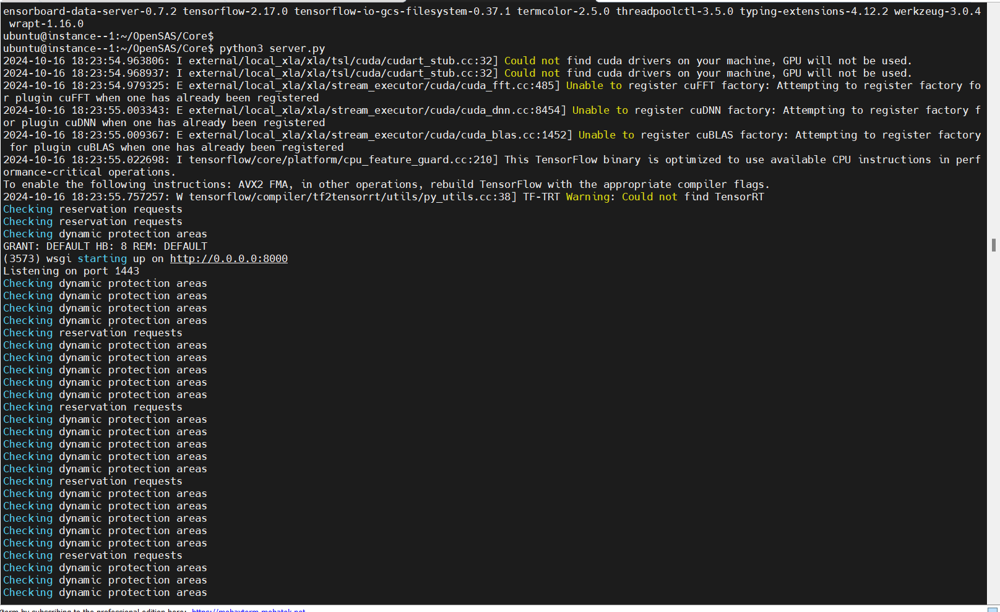
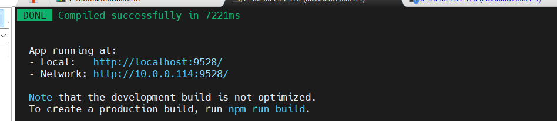
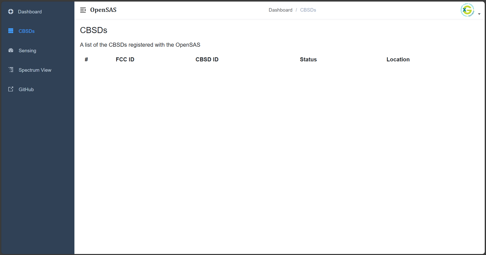

.. Installation Configuration
.. ==========================

Installation and Configuration
==============================

Building OpenSAS from Source
""""""""""""""""""""""""""""

Clone the Repository
~~~~~~~~~~~~~~~~~~~~

.. code-block:: bash

   git clone https://github.com/CCI-NextG-Testbed/OpenSAS

- This is the forked version for the Virginia Tech SAS, called OpenSAS. The role of the SAS is to allow spectrum management of CBSDs, activation of dynamic protection zones, and environmental sensing for incumbent protection. OpenSAS strives to adhere to WInnForum and FCC regulations on SAS and CBRS operations.
- The `Core/` folder contains everything required to launch the SAS Core Server. This is the true SAS. Regardless of your institution, this contains the code that is of primary interest for SAS researchers.

.. figure:: _static/image0.png
   :align: center
   :alt: SAS-CBSD State Diagram
   :scale: 50%

   **Figure:** SAS-CBSD State Diagram.

Generate Certificates
~~~~~~~~~~~~~~~~~~~~~

Then, create the CA and server/client certificates using the `create_ssl_certs.sh` script.

Navigate to the `Certs` directory and run the script:

.. code-block:: bash

   cd OpenSAS/Core/Certs
   sudo chmod +x create_ssl_certs.sh
   ./create_ssl_certs.sh

- Enter the IP of the machine running OpenSAS if making CBSD requests externally. If making the requests locally, the IP/hostname can be `127.0.0.1`.
- Before running the script, make sure to delete the existing `ca.cert` and all other `.key`, `.crt`, and `.csr` files. The only files remaining should be `create_ssl_certs.sh` and `create_client_certs.sh`. The `create_client_certs.sh` can be used to create client certs for each new client. Once existing certs are deleted, run the script.
- This will create the CA, server, and client certificates in the `Certs` folder. Copy the `ca.cert`, `client-<IP/hostname>-0.cert`, and `client-<IP/hostname>-0.key` files to the client machine (CBSD) to make HTTPS requests.

.. figure:: _static/image1.png
   :align: center
   :alt: Certificate Generation
   :scale: 50%

   **Figure:** Certificate Generation.

Update Server Configuration
~~~~~~~~~~~~~~~~~~~~~~~~~~~

Update the paths to the server certificate and key in `Core/server.py`.

.. figure:: _static/image2.png
   :align: center
   :alt: Server Configuration
   :scale: 60%

   **Figure:** Updating Server Configuration in `server.py`.

Install Requirements
~~~~~~~~~~~~~~~~~~~~

Install the necessary Python packages:

.. code-block:: bash

   pip3 install -r requirements.txt

- This will install all the required packages such as `requests`, `python-engine.io`. For the communication between the frontend and core to work, the `python-socketio` and `vue-socket.io` versions should be compatible. The versions specified in the `requirements.txt` are tested to be compatible.

.. figure:: _static/image3.png
   :align: center
   :alt: Installing Requirements
   :scale: 50%

   **Figure:** Installing Requirements.

Run the OpenSAS Server
~~~~~~~~~~~~~~~~~~~~~~

Start the OpenSAS server:

.. code-block:: bash

   cd ../
   python3 server.py

   **Figure:** OpenSAS Server Running.

The OpenSAS server will start listening for HTTPS requests from CBSDs.

**CBSDs can access the SAS via the following URL endpoints:**

.. code-block:: none

   https://<IP/hostname>:1443/sas-api/<request>

**Examples:**

- `https://127.0.0.1:1443/sas-api/registration`
- `https://192.168.0.110:1443/sas-api/registration`
- `https://localhost:1443/sas-api/spectrumInquiry`
- `https://localhost:1443/sas-api/grant`
- `https://localhost:1443/sas-api/heartbeat`
- `https://localhost:1443/sas-api/relinquishment`
- `https://localhost:1443/sas-api/deregistration`

These endpoints allow CBSDs to perform various actions such as registration, spectrum inquiry, grant requests, heartbeats, relinquishment, and deregistration with the OpenSAS server.

Building OpenSAS Dashboard from Source
""""""""""""""""""""""""""""""""""""""

Clone the Repository
~~~~~~~~~~~~~~~~~~~~

.. code-block:: bash

   git clone https://github.com/CCI-NextG-Testbed/OpenSAS-dashboard/

Install npm
~~~~~~~~~~~

Install npm if it's not already installed:

.. code-block:: bash

   sudo apt-get install npm

Install Dependencies
~~~~~~~~~~~~~~~~~~~~

From the cloned directory, install dependencies:

.. code-block:: bash

   cd OpenSAS-dashboard
   npm install --legacy-peer-deps

Configure and Run the Dashboard
~~~~~~~~~~~~~~~~~~~~~~~~~~~~~~~

- Set the IP and port to the OpenSAS SocketIO in the configuration files.
- If the OpenSAS core is running on a different VM or machine, use its IP; else it will be `localhost`.
- The port on OpenSAS is set to `8000`.

In your configuration file (e.g., `main.js`), update the connection settings:

.. code-block:: javascript

   Vue.use(new VueSocketIO({
      debug: true,
      connection: 'http://10.147.20.114:8000',
      options: { transports: ['websocket', 'polling', 'flashsocket'] } // Optional options
   }))

Then, start the dashboard:

.. code-block:: bash

   npm run dev

   **Figure:** OpenSAS Dashboard Running.

- Access the dashboard at `http://localhost:9528/`.

   **Figure:** OpenSAS Dashboard Login Page.

- You can view the list of CBSDs here.

   **Figure:** CBSD List on Dashboard.

Build from Docker Image of OpenSAS and OpenSAS Dashboard
""""""""""""""""""""""""""""""""""""""""""""""""""""""""

Alternatively, you can build and run OpenSAS using Docker. The Dockerfile provides an easy way to get started.

Install Docker Engine
~~~~~~~~~~~~~~~~~~~~~

Update your package lists and install Docker:

.. code-block:: bash

   sudo apt update
   sudo apt install docker.io

Clone the Docker Repository
~~~~~~~~~~~~~~~~~~~~~~~~~~~

.. code-block:: bash

   git clone https://github.com/CCI-NextG-Testbed/OpenSASDocker.git
   cd OpenSASDocker

Build the Docker Image
~~~~~~~~~~~~~~~~~~~~~~

.. code-block:: bash

   sudo docker build . --tag=opensas-server-dash --no-cache

Run the OpenSAS Container
~~~~~~~~~~~~~~~~~~~~~~~~~

.. code-block:: bash

   docker run --network=host --name=opensas-container -it --privileged opensas-server-dash

- The OpenSAS core and dashboard services will start automatically.
- This starts the two services:

  - **The OpenSAS core**, which will listen to HTTPS requests from CBSDs.
  - **The OpenSAS dashboard webserver**.

- The web portal can be accessed via `http://localhost:9528/`.
- The CBSDs can access the SAS via the following URL endpoints:

  - `https://localhost:1443/sas-api/registration`
  - `https://localhost:1443/sas-api/spectrumInquiry`
  - `https://localhost:1443/sas-api/grant`
  - `https://localhost:1443/sas-api/heartbeat`
  - `https://localhost:1443/sas-api/relinquishment`
  - `https://localhost:1443/sas-api/deregistration`