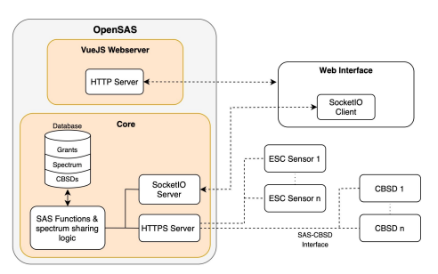

Introduction
============

Citizens Broadband Radio Service (CBRS)
---------------------------------------

The Citizens Broadband Radio Service (CBRS) spectrum (3550-3700 MHz) in the U.S. enables shared wireless communication through a three-tiered access system:

- **Incumbent Access (Tier 1)**: Reserved for military and government users with the highest priority.
- **Priority Access License (PAL, Tier 2)**: Licensed users with priority over unlicensed users, obtained via FCC auction.
- **General Authorized Access (GAA, Tier 3)**: Unlicensed users with access to available spectrum but must defer to higher tiers.

It is managed by a Spectrum Access System (SAS) to avoid interference. CBRS supports private LTE/5G networks, industrial IoT, and rural broadband, offering flexible, cost-effective connectivity.

   **Figure 1:** CBRS Three-Tier Priority Access System.

Open Source Spectrum Access System (OpenSAS)
--------------------------------------------

The role of the SAS is to allow spectrum management of CBSDs, activation of dynamic protection zones, and environmental sensing for incumbent protection. OpenSAS strives to adhere to WInnForum and FCC regulations on SAS and CBRS operations.

OpenSAS Architecture
--------------------

OpenSAS manages and enforces spectrum via the SAS-CBSD interface and the Environmental Sensing Capability (ESC) sensor nodes. The critical components incorporated inside OpenSAS to achieve this include the grant algorithm and the incumbent detection model. The architecture diagram for OpenSAS is provided in Figure 2.

   **Figure 2:** OpenSAS Architecture.

The OpenSAS code has been updated to incorporate the HTTPS protocol, aligning it more closely with the ideal WInnForum SAS architecture.

CBSD (Citizens Broadband Radio Service Device)
----------------------------------------------

A CBSD is a CBRS device, typically a 5G base station with a CBSD client running on it. For example, a CBSD client with srsRAN gNodeB (gNB).

Objective
---------

This setup outlines the installation and configuration of an OpenSAS server and dashboard on a VM for managing CBSD (Citizen Broadband Radio Service Device) operations. It includes modifying scripts for specific configurations, running CBSD machines with srsRAN and Open5GS core for testing GAA and PAL spectrum usage in the CBRS band.

